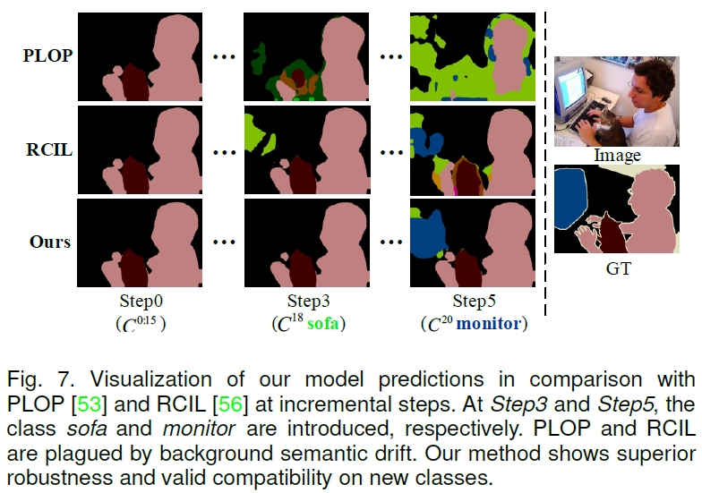
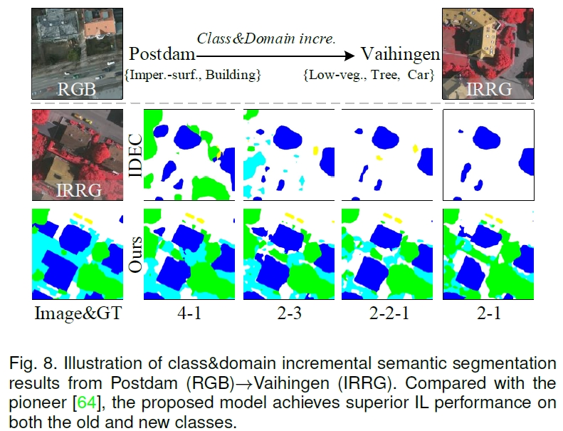
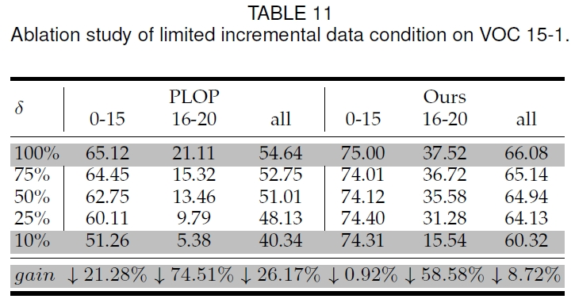

# Learning at a Glance 
**Learning At a Glance: Towards Interpretable Data-Limited Continual Semantic Segmentation Via Semantic-Invariance Modelling - TPAMI 2024**
[[paper]](https://ieeexplore.ieee.org/abstract/document/10520832/) | [[blog]](https://ybio.github.io/2024/06/01/blog_LAG/) 
### Abstract

> Continual semantic segmentation (CSS) based on incremental learning (IL) is a great endeavour in developing human-like segmentation models. However, current CSS approaches encounter challenges in the trade-off between preserving old knowledge and learning new ones, where they still need large-scale annotated data for incremental training and lack interpretability. In this paper, we present Learning at a Glance (LAG), an efficient, robust, human-like and interpretable approach for CSS. Specifically, LAG is a simple and model-agnostic architecture, yet it achieves competitive CSS efficiency with limited incremental data. Inspired by human-like recognition patterns, we propose a semantic-invariance modelling approach via semantic features decoupling that simultaneously reconciles solid knowledge inheritance and new-term learning. Concretely, the proposed decoupling manner includes two ways, i.e., channel-wise decoupling and spatial-level neuron-relevant semantic consistency. Our approach preserves semantic-invariant knowledge as solid prototypes to alleviate catastrophic forgetting, while also constraining sample-specific contents through an asymmetric contrastive learning method to enhance model robustness during IL steps. Experimental results in multiple datasets validate the effectiveness of the proposed method. Furthermore, we introduce a novel CSS protocol that better reflects realistic data-limited CSS settings, and LAG achieves superior performance under multiple data-limited conditions.


### Citation
```
@ARTICLE{LAG,
  author={Yuan, Bo and Zhao, Danpei and Shi, Zhenwei},
  journal={IEEE Transactions on Pattern Analysis and Machine Intelligence}, 
  title={Learning At a Glance: Towards Interpretable Data-Limited Continual Semantic Segmentation Via Semantic-Invariance Modelling}, 
  year={2024},
  volume={},
  number={},
  pages={1-16}}
```
## Results
 on VOC.


 
 on ISPRS.


- Data-limited continual semantic segmentation


## Dataset
### Class\&Domain Incre. - ISPRS (Postdam(RGB) to Vaihingen(IRRG))
- BaiduYun: [link](https://pan.baidu.com/s/1fPiQdPgeSPRasCB84Ru6lw) \
fetch code：`o839` | unzip pwd: `mshwkzwdjl`
Research purpose only

## Run
Most code is inherit from [IDEC](https://github.com/YBIO/IDEC). It is suggested to rerun the train and evaluation code from [IDEC](https://github.com/YBIO/IDEC).

### Inference
The following command is an example to inference the model on ISPRS dataset.
``` 
DATA_ROOT=path/to/dataset
DATASET=ISPRS
TASK=2-1
EPOCH=30
BATCH=4
VAL_BATCH=1
LOSS=bce_loss
KD_LOSS=KD_loss
LR=0.01
THRESH=0.7
CKPT=checkpoints/

python eval.py --data_root ${DATA_ROOT} --model deeplabv3_resnet101 --gpu_id 1 --lr ${LR} \
    --batch_size ${BATCH} --val_batch_size ${VAL_BATCH} --train_epoch ${EPOCH}  --loss_type ${LOSS} --KD_loss_type ${KD_LOSS} --use_KD_layer_weight\
    --dataset ${DATASET} --task ${TASK} --overlap --lr_policy step \
    --pseudo --pseudo_thresh ${THRESH} --freeze  --bn_freeze  \
    --unknown --w_transfer --amp 
```

### Train
The following command is an example to train the model on ISPRS dataset.
```
DATA_ROOT=/path/to/dataset
DATASET=ISPRS
TASK=2-1
EPOCH=30
BATCH=24
LOSS=bce_loss
KD_LOSS=KD_loss
LR=0.01
THRESH=0.7
MEMORY=0
CKPT=checkpoints/
DATA_RATIO=1.0

python run.py --data_root ${DATA_ROOT} --model deeplabv3_resnet101 --gpu_id 1,0 --lr ${LR} \
     --batch_size ${BATCH} --train_epoch ${EPOCH}  --loss_type ${LOSS} --KD_loss_type ${KD_LOSS} --use_KD_layer_weight\
     --dataset ${DATASET} --task ${TASK} --overlap --lr_policy poly \
     --pseudo --pseudo_thresh ${THRESH} --freeze  --bn_freeze  \
     --unknown --w_transfer --amp --mem_size ${MEMORY} \
     --feature_decoupling --data_ratio ${DATA_RATIO}
```

## Models
### Class\&Domain Incre. - ISPRS    
 | task | BaiduYuan \& fetch code |BUAAYun|
 | :----: | :----: | :----: |
 | 4-1   | [link](https://pan.baidu.com/s/1MpxO9_Vcg0bmv-wUi6omkg) - rsom  | [link](https://bhpan.buaa.edu.cn/link/AA0273C3FEC2AC4C5B910F919418F04BF8)
 | 2-3   | [link](https://pan.baidu.com/s/1QBlBPzomcv8MB3Ao4M8gaA) - 5ib6  | [link](https://bhpan.buaa.edu.cn/link/AA0273C3FEC2AC4C5B910F919418F04BF8)
 | 2-2-1 | [link](https://pan.baidu.com/s/1tN4_PRNiidZAuSuD4GsOZQ) - 1poz  | [link](https://bhpan.buaa.edu.cn/link/AA0273C3FEC2AC4C5B910F919418F04BF8)
 | 2-1   | [link](https://pan.baidu.com/s/1fSOFsoDghTNHGa82r6ff6Q) - gt7a  | [link](https://bhpan.buaa.edu.cn/link/AA0273C3FEC2AC4C5B910F919418F04BF8)
 
### Class Incre. - VOC
 | task | BaiduYuan \& fetch code| BUAAYun
 | :----: | :----: | :----: | 
 | 15-5   | [link](https://pan.baidu.com/s/1ABRhmD4SxMFUh1MVxZMS0w) - wc9m | [link](https://bhpan.buaa.edu.cn/link/AA0273C3FEC2AC4C5B910F919418F04BF8)
 | 15-1   | [link](https://pan.baidu.com/s/1J4Rf75_GO5UjnsYmeTr4Lg) - d9mt | [link](https://bhpan.buaa.edu.cn/link/AA0273C3FEC2AC4C5B910F919418F04BF8)
 | 5-3    | [link](https://pan.baidu.com/s/13C4-D8WgnPej1DOQiH0baw) - 7lf3 | [link](https://bhpan.buaa.edu.cn/link/AA0273C3FEC2AC4C5B910F919418F04BF8)
 | 10-1   | [link](https://pan.baidu.com/s/1A099wPqKAXMi1yynvDteMw) - j6sg | [link](https://bhpan.buaa.edu.cn/link/AA0273C3FEC2AC4C5B910F919418F04BF8)


## Related Project
- [Brain-inspired Continual Semantic Segmentation](https://ybio.github.io/2024/06/01/blog_LAG/)
- [A Survey on Continual Semantic Segmentation](https://github.com/YBIO/SurveyCSS)
- [Panoptic Perception: A Novel Task and Fine-grained Dataset for Universal Remote Sensing Image Interpretation](https://ybio.github.io/FineGrip/)


## License
©2024 YBIO *All Rights Reserved*


